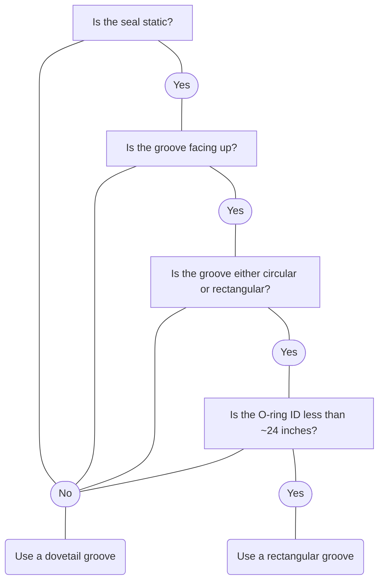

## Best Practices
### Purpose
The purpose of this standard is to summarize my knowledge of best practices for the design of elastomeric seals (O-rings). This is intended to address ~80% of typical vacuum sealing applications and is not intended to be an exhaustive resource. For additional info about seals, see [Seals and Sealing Technology BKMs](Seals%20and%20Sealing%20Technology%20BKMs.md)

### Topics 
- Rectangular vs Dovetail vs Half Dovetail
	- Use rectangular grooves whenever possible
- O-ring Sizing
	- Use 0.139” or .210” cross-sectional diameter (CSD) O-rings whenever possible
		- Smaller CSD are high risk of leaking
		- Larger CSD are expensive, cost is a function of elastomer volume/mass
- Elastomer selection
	- FKM vs FFKM (Viton vs Chemraz/Kalrez/Perlast etc.)
	- When to use alternative materials, see [O-ring materials](O-ring%20materials.md)

## Groove Design
### Rectangular Groove 

- Cross-section is rectangular
- Use with static seals
- Use if groove is facing up (gravity keeps seal in groove)
- Use if groove is less than ~24" in diameter
- Recommended dimensions below

#### For -200 (0.139" CSD) O-rings operating at 20C-260C

#### For -300 (0.210” CSD) O-rings operating at 20C to 260C

### Dovetail Groove

- Cross-section is dove-tail in shape
- Use with dynamic seals
	- motion pulls seal out of groove
- Use when groove is facing down
	- gravity pulls seal out of groove
- Use when groove is not cir
- cular or rectangular (ie, serpentine)
	- seal will not stay in groove during installation
- Use when groove is large diameter
	- seal may roll/twist during installation
- Recommended dimensions shown below

#### For -200 (0.139" CSD) O-rings operating at 20C-260C

#### For -300 (0.210” CSD) O-rings operating at 20C to 260C

## Groove Design Decision Tree

Made using [Mermaid Flow](https://www.mermaidflow.app/editor)

## O-ring Sizing
See also: [O-ring size standards](O-ring%20size%20standards.md)

- Recommended O-ring Sizes
	- 0.139” cross-sectional diameter (CSD): AS568 sizes 201-284
	- 0.210” CSD: AS568 sizes 309-395
	- [AS568 standard]([Global_O-Ring_AS568_Guide.pdf%20(globaloring.com)](https://www.globaloring.com/wp-content/uploads/2018/10/Global_O-Ring_AS568_Guide.pdf))
- Other sizes
	- Larger CSD o-rings can be used with minimal risk
		- This will increase cost
	- Smaller CSD o-rings will increase the risk of leaking
		- Should be reviewed thoroughly before selective for application, avoided if possible. 

## Gland Design Guidelines

- Design grooves for use with FFKMs (Chemraz, Kalrez, etc.) and they will function with FKMs (Viton) as well
	- The opposite is not true. Due to the higher CTE of FFKMs they will overfill a groove designed for FKMs when operating at elevated temperatures
- Stretch: the amount that the ID of the seal is stretched
	- Nominal = 0-1.5%
	- Maximum = 3%
		- Can be exceeded with Viton but runs the risk of reduced lifetime when you get above 5%
- Compression: the amount that the CSD is compressed
	- Minimum 15%
	- Nominal 20%
	- Maximum 25-30%
- Glandfill: the volume of the groove that is filled by the seal
	- Maximum 95%
- These are only intended to guide general gland design and do not guarantee all seals will be able to maintain vacuum level sealing

## Elastomer Selection 
See also: [O-ring materials](O-ring%20materials.md)

- When to use FKM (Viton)
	- Cost sensitive applications with little to no exposure to Fluorine or Oxygen plasmas
	- Examples: large chamber o-rings, foreline o-rings

- When to use FFKM (Chemraz/Kalrez/Perlast etc)
	- Any application that comes in direct contact with a component where cleanliness if of the utmost importance
	- Operating temperatures exceed 180˚C
	- Minimal to high exposure to Fluorine or Oxygen Plasma
	- Any exposure to Ammonia (NH3)
	- For specific FFKM compatibility/recommendations contact [Seals and Sealing Technology suppliers](Seals%20and%20Sealing%20Technology%20suppliers.md)

- When to use alternative materials
	- Fluorinert heat exchanger fluids (silicone)
	- Oxygen plasma only (blue fluorosilicone)