## Description
Holds all the info on my songs

## Songwriting tools
Tab formatting in markdown: https://github.com/ultimate-guitar/Tabdown

Chords in markdown: https://dnotes.github.io/markdown-it-chords/

Implement eventually

## Potential song Ideas

**001-007-001**

**13's a banger**

**Shitty Orville Peck**

**Montana Cabin**

**Polyamory**

**Baby Girl**

**Someray**

**Unnamed**

**Ol' Whatshisface**

**Walking Around**

**2019_12_02_19_17_28 - Michaelas Song**

**Church Girl**

**UAP**

**Gimme a tatoo**

## Handwritten stuff to parse later

### 001-007-001

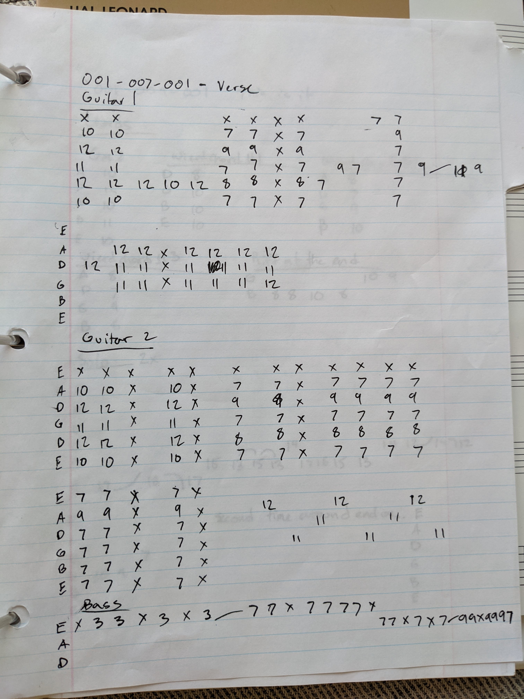

### 001-003-001

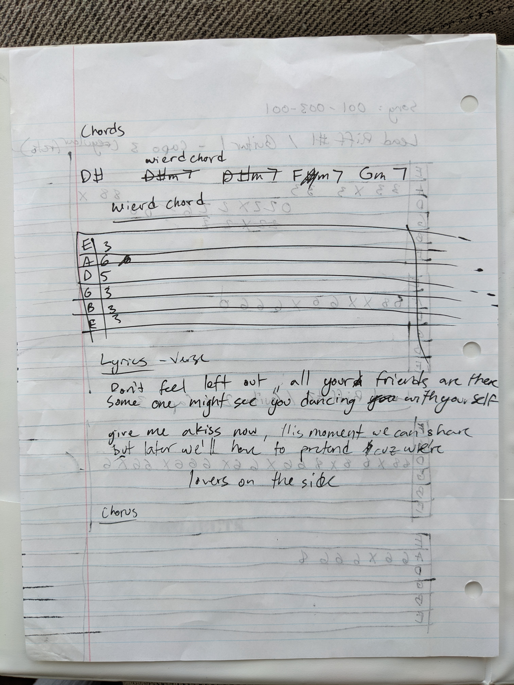

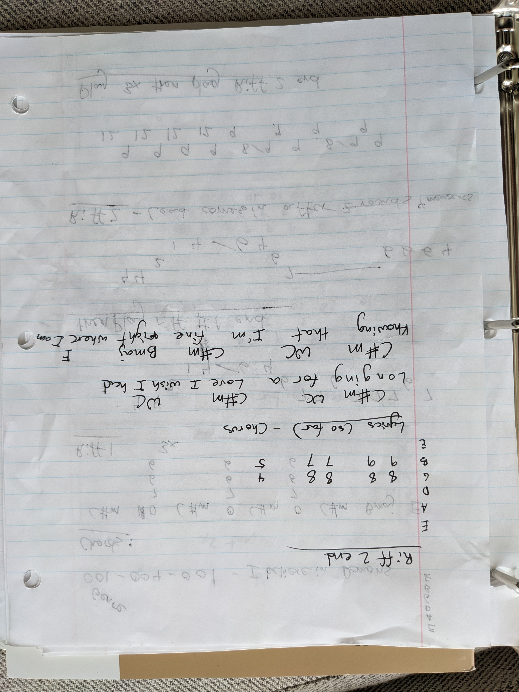

### 001-004-001

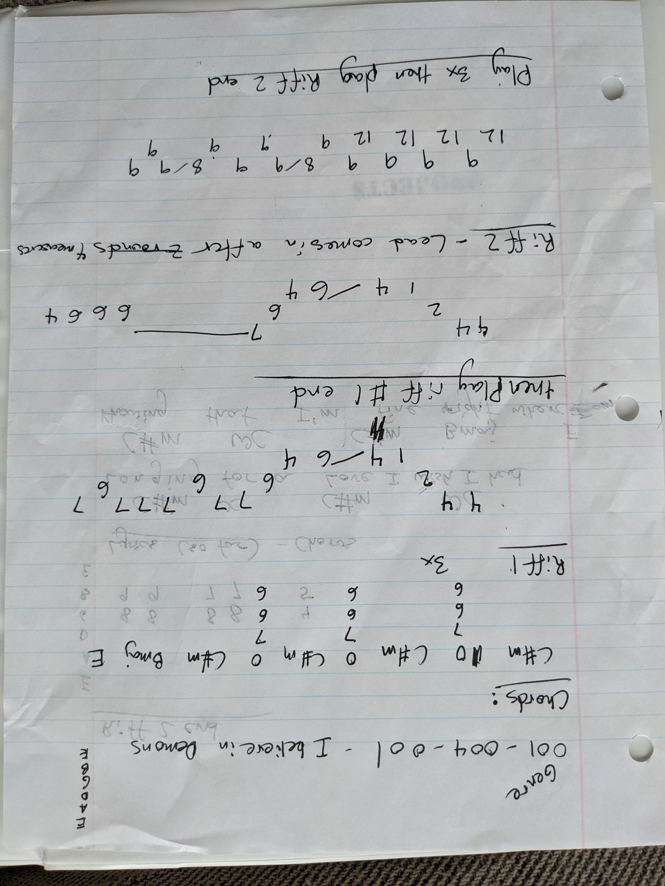

### 001-002-001

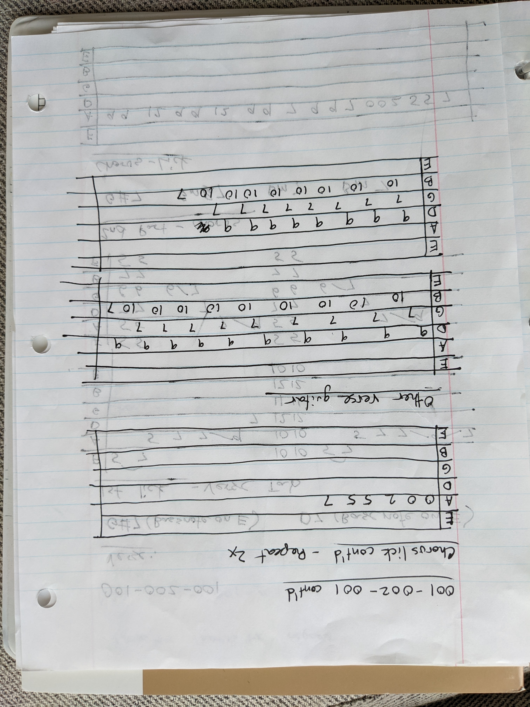

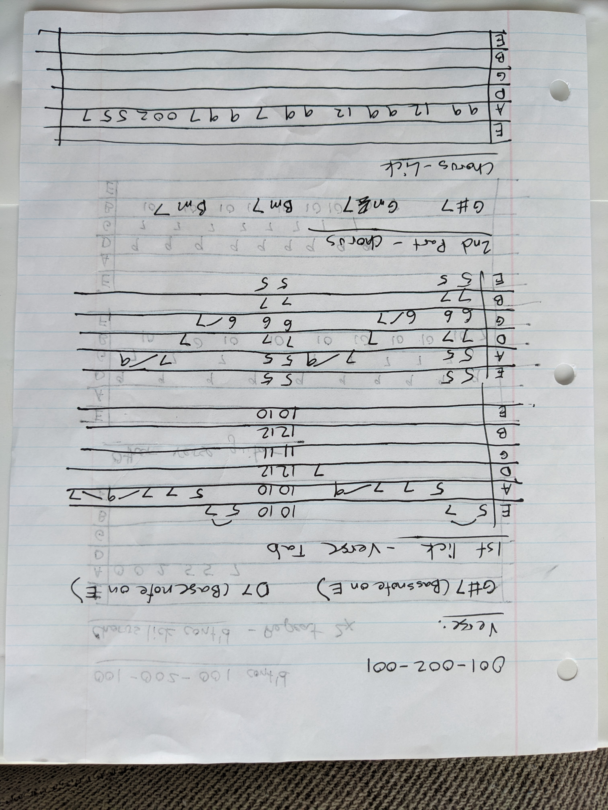

### 001-001-001

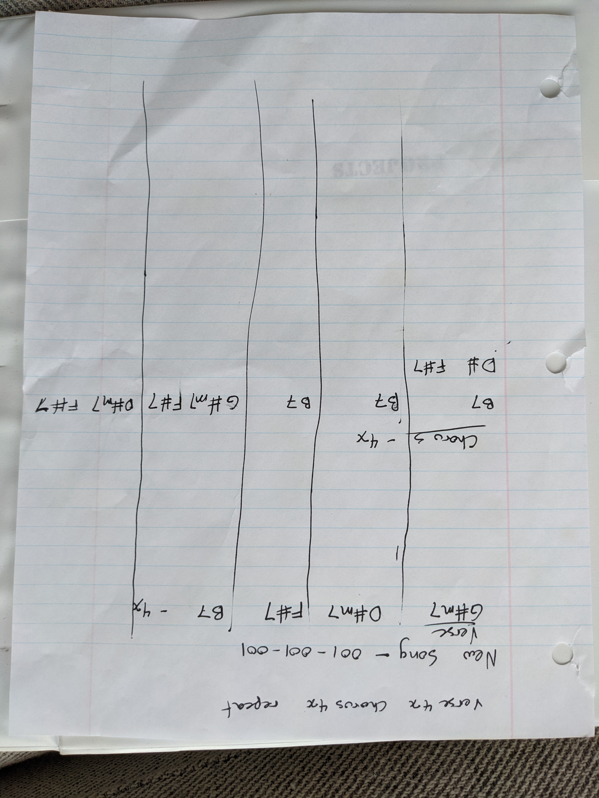

### 001-005-001 ([Michaela](../../../2AREAS/RELATIONSHIPS/PEOPLE/Michaela%20Haaser.md)'s song)

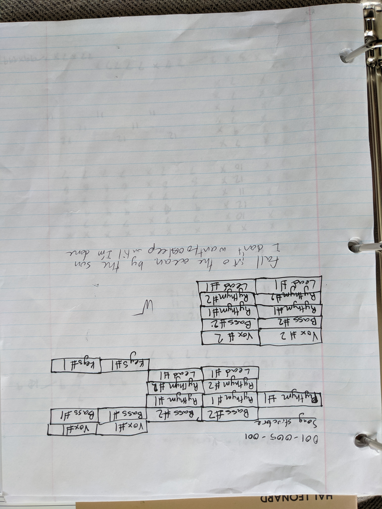

### 001-009-001

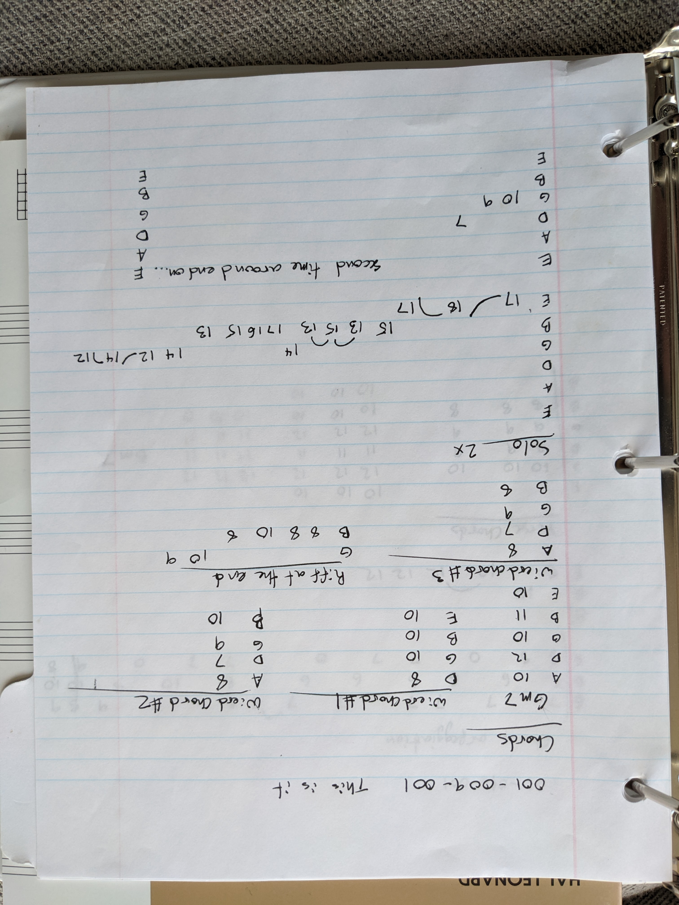

### 001-010-001

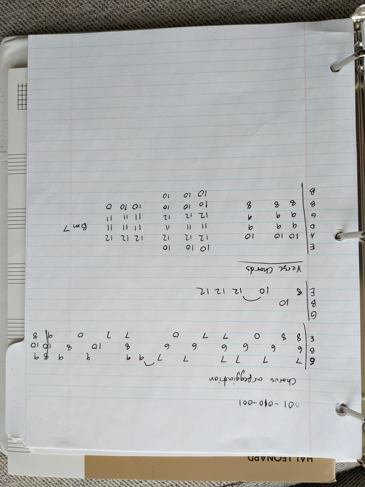

### CoDA

### And How

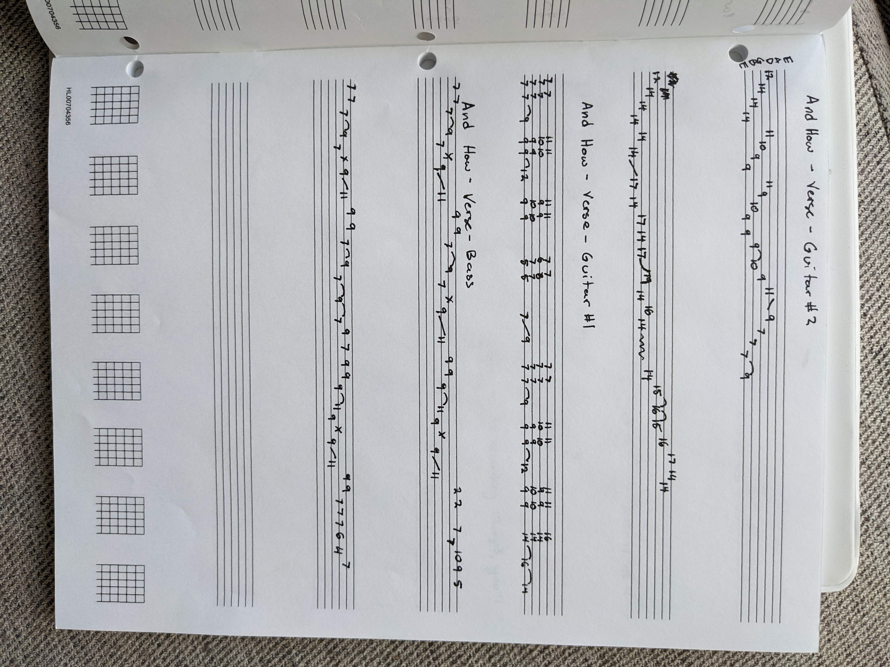

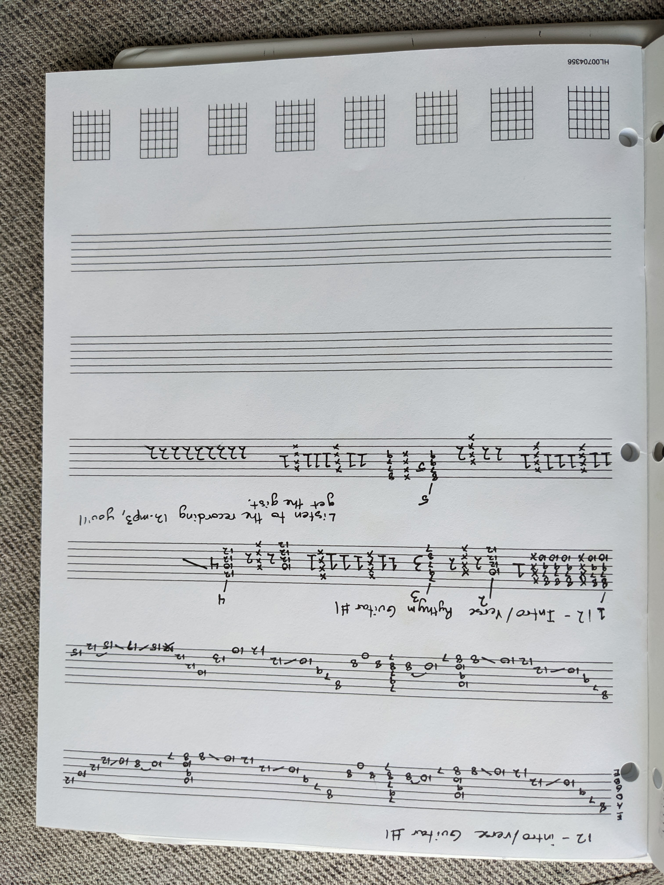

